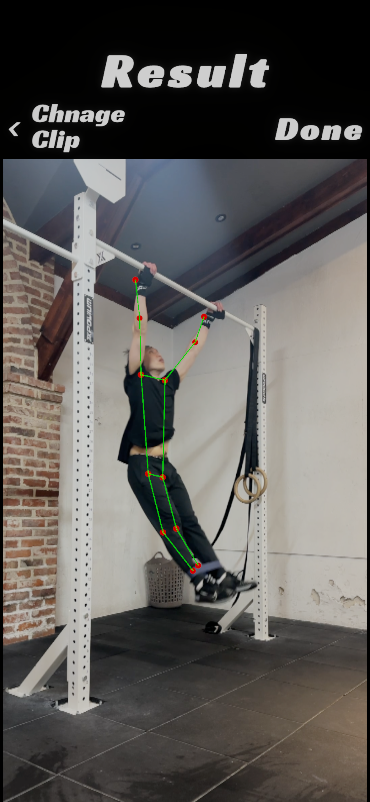

# MarkForm: WorkoutTracker

## Task
Human Pose Estimation

## Description
This project uses the YOLO11 pose model to detect and draw keypoints of human poses in videos.



## Requirements
- Unity 6 or higher
  - Uses Sentis

## Getting Started
1. **Clone the repository**
   ```sh
   git clone https://github.com/your-username/WorkoutTracker.git
2. Open the project in Unity
- Use Unity 6 or newer.
3. Install Dependencies
- Make sure the Sentis package is installed via Unity Package Manager.
4. Run the Project
- Open the desired scene and press Play to start pose estimation.

## Features
- Human pose estimation using YOLO11 model
- Visualization of keypoints on video frames

## Acknowledgements
This project referenced the following repository:
- [skykim/uniteseoul2025-motiontracking](https://github.com/skykim/uniteseoul2025-motiontracking)